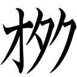
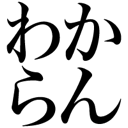
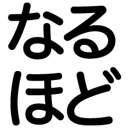
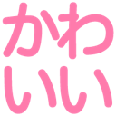
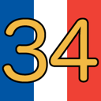

# emoji

Emojis created by hideo54

## License

[Creative Commons Zero v1.0 Universal](LICENSE)

## Emojis

`:otaku:` | `:tokuyuno:` | `:hayakuchi:`
:-: | :-: | :-:
 |  | 

`:wakaru:` | `:wakaran:` | `:naruhodo:`
:-: | :-: | :-:
 |  | 

`:kawaii:` | `:terror:` | `:uts1-34:`
:-: | :-: | :-:
 |  | 