# emoji

Emojis created by hideo54

## License

[Creative Commons Zero v1.0 Universal](LICENSE)

## Emojis

`:otaku:` | `:tokuyuno:` | `:hayakuchi:`
:-: | :-: | :-:
 |  | 

`:wakaru:` | `:wakaran:` | `:terror:`
:-: | :-: | :-:
[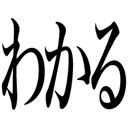](https://github.com/hideo54/emoji/raw/master/images/wakaru.png) |  | [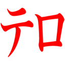](https://github.com/hideo54/emoji/raw/master/images/terror.png)

`:naruhodo:` | `:koresuki:` | `:kawaii:`
:-: | :-: | :-:
 | [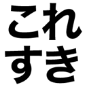](https://github.com/hideo54/emoji/raw/master/images/koresuki.png) | 

`:yuno:` | `:muno:` | `:hontoni:`
:-: | :-: | :-:
[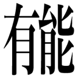](https://github.com/hideo54/emoji/raw/master/images/yuno.png) | [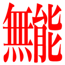](https://github.com/hideo54/emoji/raw/master/images/muno.png) | 

`:kimo:` | `:koegadekai:` | `:shogakusei:`
:-: | :-: | :-:
[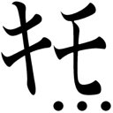](https://github.com/hideo54/emoji/raw/master/images/kimo.png) | [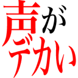](https://github.com/hideo54/emoji/raw/master/images/koegadekai.png) | 

`:ada:` | `:saibansho:`
:-: | :-:
[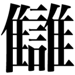](https://github.com/hideo54/emoji/raw/master/images/ada.png) | [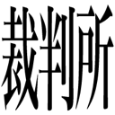](https://github.com/hideo54/emoji/raw/master/images/saibansho.png)

`:jinko-chino:` | `:singularity:`
:-: | :-:
 | 

`:yujo:` | `:yu:` | `:ryo:`
:-: | :-: | :-:
[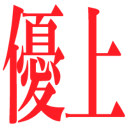](https://github.com/hideo54/emoji/raw/master/images/yujo.png) | [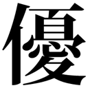](https://github.com/hideo54/emoji/raw/master/images/yu.png) | [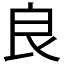](https://github.com/hideo54/emoji/raw/master/images/ryo.png)

`:ka:` | `:fuka:` | `:uts1-34:`
:-: | :-: | :-:
 | [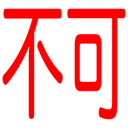](https://github.com/hideo54/emoji/raw/master/images/fuka.png) | 

* 本リポジトリの絵文字のうち、黒い文字については全て、2~3 px の白縁をつけることで Dark mode 対応としています。
